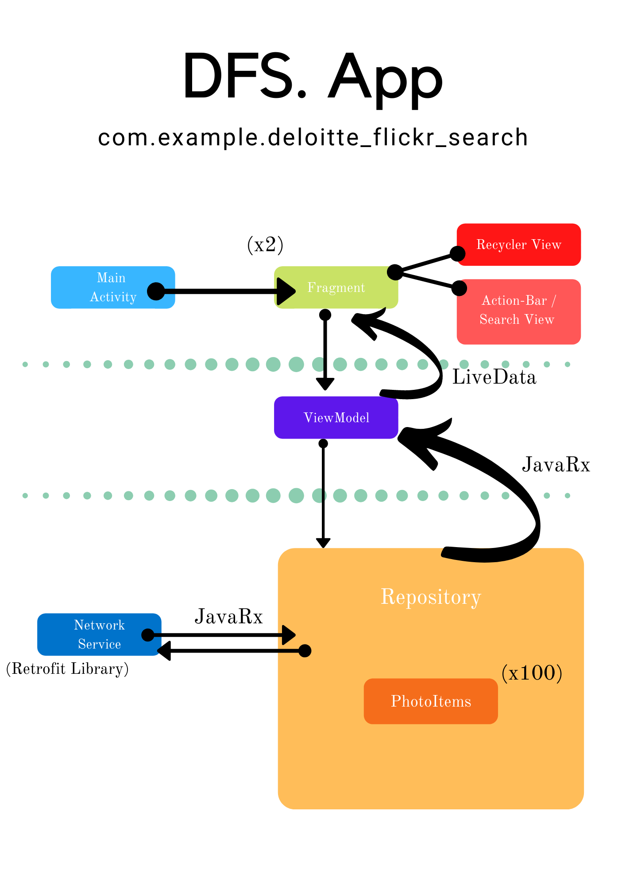

<h1 align="center">
  Deloitte-Flicker-search 
</h1>

<p align="center">
  
</p>

Skill Showcase App


> An image searching app with intuitive design. Uses the Flickr image search API and shows the results in a 3-column scrollable view.

<p align="center">
  
</p>


## Built With

- Android
- Kotlin 
- Flickr Rest-Api

## Added Dependancies

```kotlin
 //NETWORK DEPENDANCIES
implementation "com.squareup.retrofit2:retrofit:2.5.0"
implementation "com.google.code.gson:gson:2.8.5"
implementation "com.squareup.retrofit2:converter-gson:2.4.0"
implementation 'com.squareup.retrofit2:adapter-rxjava2:2.9.0'

//IMAGE VIEW RENDERING DEPENDANCIES
implementation 'com.github.bumptech.glide:glide:4.11.0'
implementation "pl.droidsonroids.gif:android-gif-drawable:1.2.18"

//RX JAVA DEPENDANCIES
implementation 'androidx.lifecycle:lifecycle-extensions:2.2.0'
implementation 'io.reactivex.rxjava2:rxandroid:2.1.0'
implementation 'io.reactivex.rxjava2:rxjava:2.2.0'

//DI DEPENDANCIES
implementation("com.google.dagger:hilt-android:2.35")
kapt("com.google.dagger:hilt-android-compiler:2.35")
```


## Architecture Pattern and Components overview

 

## Dependancy Injection

DI was done using the 'Dagger-Hilt' library. The dependancies are declared under the ['com.example.deloitte_flickr_search.dependancies'](https://github.com/MDeMel-Dev/Deloitte-Flickr-search/tree/master/app/src/main/java/com/example/deloitte_flickr_search/dependancies)  package as Hilt Modules.

- A repository instance is provided (injected into) the [ViewModel ](https://github.com/MDeMel-Dev/Deloitte-Flickr-search/blob/master/app/src/main/java/com/example/deloitte_flickr_search/MainViewModel.kt)through constructor injection.
- Similarly the 'Network Service' Objects are injected into the [Repository.](https://github.com/MDeMel-Dev/Deloitte-Flickr-search/tree/master/app/src/main/java/com/example/deloitte_flickr_search/repository)

the above implementation facilitates a single source of truth for networking functions for future iterations of this app.

## Pagination

Pagination is achieved by making an API call everytime the user reaches the end of a 'page's items'. 
This is achieved utilizing  [nested scroll view](https://github.com/MDeMel-Dev/Deloitte-Flickr-search/blob/master/app/src/main/java/com/example/deloitte_flickr_search/ui/home/MainFragment.kt) and comparing it against the recyclerview height.

```kotlin
fun doPaging()
    {
        nestedScrollView!!.setOnScrollChangeListener(NestedScrollView.OnScrollChangeListener { v: NestedScrollView, scrollX: Int, scrollY: Int, oldScrollX: Int, oldScrollY: Int ->
            if (scrollY == v.getChildAt(0).measuredHeight - v.measuredHeight) {
                Toast.makeText(this.context,"loading images",Toast.LENGTH_SHORT).show()
                //INITIATE THE PAGINATION API CALL
                mainViewModel.paginateAPIData(mainViewModel.currentText , mainViewModel.nextPage , requireActivity()!!.application)
                //INCREMENT THE CURRENT PAGE COUNTER BY 1
                mainViewModel.nextPage +=1
            }
        })
    }
```
It's a simple implementation and one that provides the necessary functionality versus the complexity of caching and using the local database along with a pagination library like google's 'Paging3'.

## Accessibility Features

Fundamental accessibility practices followed

- Item color contrast threshold for better visibility
- added content description for all views

## Security Enhancements

Although not implemented for the sake of transparent code in the case of inspection, using 'obfuscation' will greatly enhance the security by the means of a tool like 'ProGuard'.

## Testing

2 tests implemented 
- [1 local unit test](https://github.com/MDeMel-Dev/Deloitte-Flickr-search/blob/master/app/src/test/java/com/example/deloitte_flickr_search/networking/MainResponseTest.kt)


Test for the correctness of the deserialization data class 'MainResponse' on API call using a ['mock' retrofit ](https://github.com/MDeMel-Dev/Deloitte-Flickr-search/blob/master/app/src/test/java/com/example/deloitte_flickr_search/networking/MockRetrofit.kt) instance that is being passed a local json file - ['mockflickrdata.json'](https://github.com/MDeMel-Dev/Deloitte-Flickr-search/blob/master/app/src/test/java/com/example/deloitte_flickr_search/networking/mockflickrdata.json)

- [1 instrumented unit test](https://github.com/MDeMel-Dev/Deloitte-Flickr-search/blob/master/app/src/androidTest/java/com/example/deloitte_flickr_search/ui/home/MainFragmentTest.kt)


Test for the correct navigation of Fragments using 'Espresso' components and the 'TestNavHostController'.

## Setup

2 Options
1. Use apk provided - drag and drop to emulator 
2. Clone github repository to Android Studio Project Directory and Build.


## Authors

👤 **Manendra De Mel**

- GitHub:[@Mane](https://github.com/MDeMel-Dev)
- LinkedIn:[Manendra Melbourne,Victoria](https://www.linkedin.com/in/manendra-de-mel)
- Website:[Personal Website](https://mnc22.com)

## ⭐️ Acknowledgments

- Retrofit by Square
- droidsonroids.gif.drawable

## 📝 License

This project is [MIT](lic.url) licensed.
